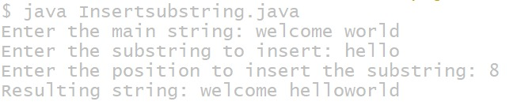
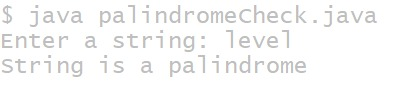

# additional experiment
## title :2.)find the sum of the first n Fibonacci numbers
```
import java.util.Scanner;
class Fibonacci {
    int sum;
    int n;
    int firstNumber;
    int secondNumber;
    int thirdNumber;
    Fibonacci(int number) {
        n = number;
        firstNumber = 0;
        secondNumber = 1;
        thirdNumber = 0;
        sum = 0;
    }
    void generate() {
       if(n>0)
        System.out.print("Fibonacci series: ");
        while (n > 0) {
            if (n == 1) {
                System.out.println(firstNumber + ".");
                sum = sum + firstNumber;
            } else {
                System.out.print(firstNumber + ", ");
                sum = sum + firstNumber;
            }
            thirdNumber = firstNumber + secondNumber;
            firstNumber = secondNumber;
            secondNumber = thirdNumber;
            n--;
        }

        System.out.println("Sum of Fibonacci series = " + sum);
    }
    public static void main(String[] args) {
        Scanner sc = new Scanner(System.in);
        System.out.print("Enter the value of n: ");
        int number = sc.nextInt();
        Fibonacci f = new Fibonacci(number);
        f.generate();
    }
}
```
# output

## title :1) write a java program to insert a substring
```
import java.util.Scanner;

public class InsertSubstring {
    public static void main(String[] args) {
        Scanner sc = new Scanner(System.in);

        // Input main string
        System.out.print("Enter the main string: ");
        String mainString = sc.nextLine();

        // Input substring
        System.out.print("Enter the substring to insert: ");
        String subString = sc.nextLine();

        // Input position
        System.out.print("Enter the position to insert the substring: ");
        int position = sc.nextInt();

        // Check valid position
        if (position < 0 || position > mainString.length()) {
            System.out.println("Invalid position!");
        } else {
            // Extract parts of the main string
            String firstPart = mainString.substring(0, position);
            String secondPart = mainString.substring(position);

            // Insert substring
            String resultString = firstPart + subString + secondPart;

            // Display result
            System.out.println("Resulting string: " + resultString);
        }

        sc.close();
    }
}
```
## output

## title:3)given string is palindrome or not
```
import java.util.Scanner;

public class PalindromeCheck {
    public static void main(String[] args) {
        Scanner sc = new Scanner(System.in);

        // Input string
        System.out.print("Enter a string: ");
        String str = sc.nextLine();

        // Initialize pointers
        int start = 0;
        int end = str.length() - 1;

        boolean isPalindrome = true;

        // Compare characters from both ends
        while (start < end) {
            if (str.charAt(start) != str.charAt(end)) {
                isPalindrome = false;
                break;
            }
            start++;
            end--;
        }

        // Display result
        if (isPalindrome) {
            System.out.println("String is a palindrome");
        } else {
            System.out.println("String is not a palindrome");
        }

        sc.close();
    }
}
```
## output

